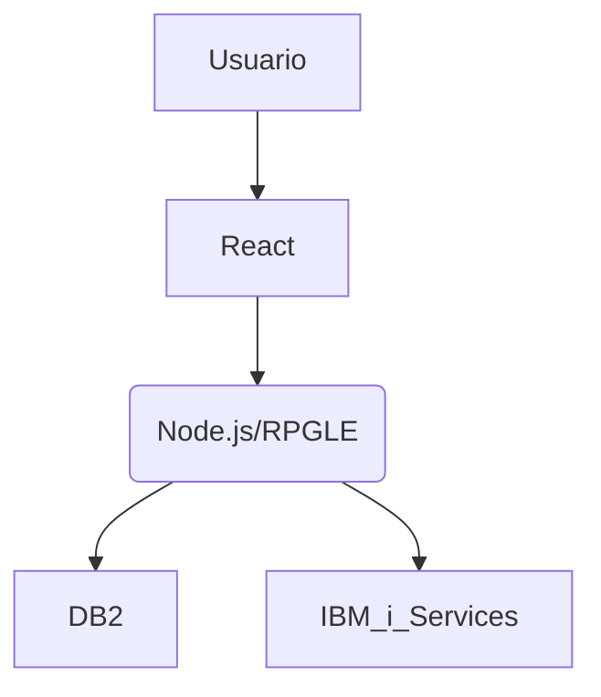

# 🏗️ Arquitectura del Proyecto

Nuestra aplicación sigue un modelo **cliente-servidor**, donde el **frontend** está desarrollado en **ReactJS**, el **backend** en **RPGLE/Node.js** y la **base de datos** en **DB2**.

## 🌐 Frontend (ReactJS)
- UI en React con gestión de estado.
- Comunicación con backend vía API.

## 🖥️ Backend (RPGLE en AS400 )
- API REST en RPGLE accesible desde el frontend.
- Autenticación mediante token API.
- Conexión a la base de datos DB2 para operaciones CRUD.
- Servicios IBM i para operaciones específicas.
- Manejo de errores y validaciones.

## 📦 Base de Datos
- (Explicar el modelo de base de datos y su estructura).

## 🔹 Diagrama General

## 🔹 Componentes Principales
- Frontend: ReactJS con autenticación vía API
- Backend: API en RPGLE/Node.js expuesta vía CGI
- Base de datos: DB2 en IBM i